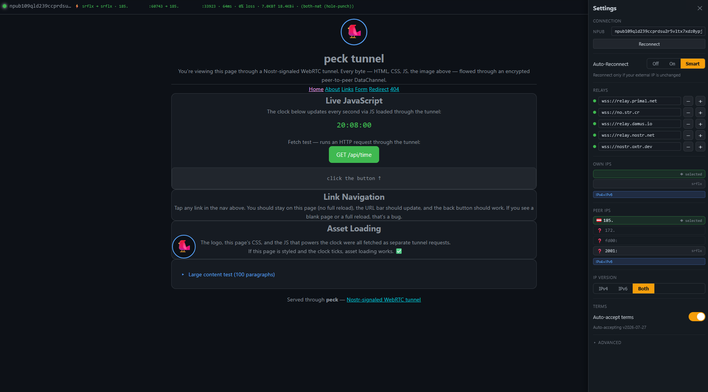

# peck

**Nostr-signaled WebRTC tunnel. Punch through NAT with nothing but a Nostr public key.**

`peck` connects a browser directly to any server behind NAT — no TURN, no VPN, no port forwarding. WebRTC hole-punching with [Nostr](https://github.com/nostr-protocol/nostr) relays as the signaling layer. All signaling is [NIP-44](https://github.com/nostr-protocol/nips/blob/master/44.md) encrypted.



> **Status**: Beta. E2E-validated in production at [dns2nostr.com](https://dns2nostr.com).
>
> **Try it out**: Visit [peck.dns2nostr.com](https://peck.dns2nostr.com) or [npub109qld239ccprdsu2r5vltx7xdz0ypjk0dts42d37lqeceuuz64ss5aq9dk.dns2nostr.com](https://npub109qld239ccprdsu2r5vltx7xdz0ypjk0dts42d37lqeceuuz64ss5aq9dk.dns2nostr.com) to see a live peck tunnel in action.

---

## Why?

Exposing a home server, self-hosted app, or anything behind NAT usually means:

- Port forwarding (requires router access, breaks on CGNAT)
- TURN relay (centralized, expensive, single point of failure)
- VPN overlay (extra software on both sides, routing complexity)

`peck` needs none of that. The browser opens a direct P2P tunnel to the daemon using only the daemon's Nostr npub as identity. Nostr relays carry the encrypted signaling handshake — they never route traffic and never see plaintext.

## How it works

```
 ┌──────────┐                    Nostr Relays                  ┌───────────┐
 │ Browser  │ ◄──────── NIP-44 encrypted DMs ────────────────► │  Daemon   │
 │          │   (announce, offer, answer, ICE candidates)      │ (Python)  │
 │          │                                                  │           │
 │  WebRTC  │ ◄─────────── direct P2P DataChannel ───────────► │  aiortc   │
 │  client  │             (NAT hole punched)                   │           │
 │          │                                                  │           │
 │  fetch() │ ── HTTP over DataChannel ──────────────────────► │ localhost │
 └──────────┘                                                  └───────────┘
```

1. Daemon starts, generates a Nostr keypair, connects to relays
2. Browser resolves the daemon's npub from the URL hostname
3. Browser sends an encrypted `announce` DM via Nostr relays
4. Daemon responds with a WebRTC `offer` (SDP) — also encrypted
5. Browser sends back the `answer` + ICE candidates (trickle)
6. WebRTC DataChannel opens — direct P2P tunnel established
7. HTTP requests from the browser flow over the DataChannel to the daemon's local backend

**Privacy**: The web server only serves static files. It never sees the npub, relay traffic, or tunneled content. The signaling is end-to-end encrypted between browser and daemon. Nostr relays carry ciphertext only.

**Speed**: The connection establishes in **1–5 seconds** in the best case (relay round-trip + ICE gathering + WebRTC handshake). Once the DataChannel is open, throughput depends on the network route between browser and daemon — there is no relay in the data path.

## Why peck?

**Permissionless to deploy.** No domain registration, no DNS setup, no TLS certificate, no Cloudflare, no port forwarding. Generate a Nostr key, start the daemon, share the npub. That's it. The npub is the address.

**Permissionless to visit.** No account, no login, no app install. Open `npub1xxx.yourdomain.com` in any modern browser — the tunnel establishes automatically.

**You decide who gets in.** Built-in access control: whitelist by npub, block by IP range, restrict by country/region, or require terms-of-service acceptance. The policy engine runs in the daemon — no external service, no API to call. See [Access Control & Policy](docs/ACCESS_CONTROL.md).

**IP diversity without exposing your server.** Run multiple WireGuard exit tunnels — each visitor gets routed through a different exit IP. The daemon's real IP never appears in the browser. *(Proof of concept — see limitation note below.)*

**No single point of failure.** No central server routes your traffic. Nostr relays carry only the encrypted signaling handshake; once the WebRTC DataChannel is open, all traffic flows peer-to-peer. Multiple relays provide redundancy — if one goes down, the others keep the signaling alive.

**DDoS-resistant by architecture.** There is no public HTTP endpoint to flood. The daemon is reachable only through Nostr DMs (which require knowing the npub and establishing a WebRTC connection first). Attackers can't trivially enumerate or overwhelm the daemon.

**Self-hosted, self-controlled.** No vendor lock-in. No subscription. No proprietary protocol. The daemon runs on your hardware, the browser client is static files you serve yourself.

**Censorship-resistant.** No domain to seize, no DNS to manipulate (npub-based subdomains need no DNS record). Blocking peck requires blocking Nostr relays or WebRTC entirely — both are heavy-handed measures.

## Tested VPN Providers

| Provider | IPv4 | IPv6 | Notes |
|----------|------|------|-------|
| IVPN | ⚠️ Works with limitations | ✅ Good, open | IPv4 has some NAT-related issues; IPv6 exit works well with NPTv6 1:1 |
| Mullvad | TBD | TBD | Not yet tested |

See [WireGuard Multi-Tunnel Setup](docs/WIREGUARD.md) for configuration details.

## Quick Start

### Prerequisites

**Daemon**: Python 3.10+, and system dependencies for `aiortc`:

```bash
# Debian/Ubuntu
sudo apt install libavdevice-dev libavfilter-dev libavformat-dev libavcodec-dev libavutil-dev libswscale-dev libswresample-dev libsrtp2-dev

# Create venv and install
python3 -m venv venv
source venv/bin/activate
pip install aiortc aiohttp coincurve aiohttp-websockets loguru pyyaml
```

**Browser client**: Any static file server (nginx, caddy, python -m http.server). A subdomain per daemon is recommended (e.g. `npub1abc.yourdomain.com`).

### 1. Start the daemon

```bash
# Generate a Nostr private key (32-byte hex)
python3 -c "import secrets; print(secrets.token_hex(32))" > ~/.config/peck/nsec
chmod 600 ~/.config/peck/nsec

# Run the daemon
cd daemon
python daemon.py \
  --nsec-file ~/.config/peck/nsec \
  --ports 80:http://127.0.0.1:8080 \
  --relays wss://relay.damus.io,wss://relay.primal.net \
  --wg-ips <your-server-ipv4> \
  --domain-suffix yourdomain.com
```

The daemon prints its npub on startup. That's the public identity browsers connect to.

> **Key format**: The nsec file accepts both hex (64 chars) and bech32 (`nsec1...`) format. Both are decoded automatically.

### 2. Serve the browser client

Deploy these files to your web server:

```
/var/www/peck/
├── client.html
├── sw.js
├── peck-config.json          (optional)
├── vendor/                   # @noble/* bundles (see below)
│   ├── secp256k1.mjs
│   ├── sha2.mjs
│   ├── hmac.mjs
│   ├── chacha.mjs
│   └── utils.mjs
└── src/
    ├── client.js
    ├── native-transport.js
    ├── nip44-browser.js
    ├── protocol.js
    ├── wg-country-codes.js
    └── geoip-data.js
```

**Vendored crypto bundles**: The browser client uses [@noble/secp256k1](https://github.com/paulmillr/noble-secp256k1), [@noble/hashes](https://github.com/paulmillr/noble-hashes), and [@noble/ciphers](https://github.com/paulmillr/noble-ciphers) for NIP-44 encryption. These are vendored as self-hosted `.mjs` bundles (no CDN dependency at runtime). To generate them:

```bash
cd browser
npm install
mkdir -p vendor
# Bundle each dependency as a single .mjs file
npx esbuild @noble/secp256k1 --bundle --format=esm --outfile=vendor/secp256k1.mjs
npx esbuild @noble/hashes/sha2 --bundle --format=esm --outfile=vendor/sha2.mjs
npx esbuild @noble/hashes/hmac --bundle --format=esm --outfile=vendor/hmac.mjs
npx esbuild @noble/ciphers/chacha --bundle --format=esm --outfile=vendor/chacha.mjs
npx esbuild @noble/hashes/utils --bundle --format=esm --outfile=vendor/utils.mjs
```

The import map in `client.html` maps `@noble/*` to `/vendor/*.mjs`. See [THIRD_PARTY.md](THIRD_PARTY.md) for license information.

**Optional**: Create a `peck-config.json` to override defaults:

```json
{
  "default_relays": [
    "wss://relay.damus.io",
    "wss://relay.primal.net"
  ],
  "reconnect": {
    "max_attempts": 3,
    "delays_ms": [5000, 10000, 20000]
  },
  "ice_gathering_timeout_ms": 3000,
  "info_mandatory": "npub"
}
```

If `peck-config.json` is absent, hardcoded defaults apply (fully backward compatible).

### 3. Connect

Visit `https://npub1xxx.yourdomain.com/` — the browser auto-resolves the npub from the subdomain and connects.

No DNS lookup needed for npub-based subdomains — the npub is parsed directly from the hostname. Zero latency, zero DNS footprint.

For human-readable subdomains (`blog.yourdomain.com`), set a DNS TXT record:

```
blog.yourdomain.com.  IN  TXT  "npub=<hex-pubkey>"
```

The browser does a DoH (DNS-over-HTTPS) lookup to resolve the alias.

## Architecture

### Signaling: NIP-44 v2 encrypted DMs

All signaling between browser and daemon uses NIP-44 v2 encrypted Direct Messages (Nostr kind=4 events). Both sides generate ephemeral Nostr keypairs. Messages are encrypted with the recipient's public key and signed with ChaCha20-Poly1305 + HKDF-chacha20.

The browser side uses `@noble/secp256k1`, `@noble/hashes`, and `@noble/ciphers` (vendored, no CDN dependency). The daemon uses `coincurve` for Schnorr signing.

### Transport: native WebRTC

**Browser**: Native `RTCPeerConnection` + `RTCDataChannel`. No WebRTC polyfills, no `werift`, no `wrtc` npm packages.

**Daemon**: Python `aiortc`. Handles the WebRTC offer/answer exchange and manages the DataChannel.

### HTTP over DataChannel

Once the DataChannel is open, the browser sends HTTP requests as binary frames over the channel. The daemon parses them, forwards to the local backend, and streams responses back. A multiplexer (`protocol.js` / `ports.py`) supports multiple concurrent streams over a single DataChannel.

A Service Worker intercepts `fetch()` calls and routes them through the tunnel, so existing web apps work without modification.

### Multi-port routing

The daemon supports multiple backend ports via path-prefix routing (`/_p<port>/path`) or subdomain routing. See `--ports-config` for multi-backend setups.

## Configuration

### Daemon CLI flags

| Flag | Required | Default | Description |
|------|----------|---------|-------------|
| `--nsec-file` | yes | — | Path to Nostr private key file |
| `--relays` | yes | — | Comma-separated Nostr relay URLs |
| `--wg-ips` | yes | — | Comma-separated WireGuard/server IPv4 addresses |
| `--ports` | no | `80:http://127.0.0.1:8080` | Port mapping: `extern:http://backend` |
| `--ports-config` | no | — | YAML/JSON multi-port config |
| `--backends` | no | — | YAML route table for multi-backend mode |
| `--domain-suffix` | no | `localhost` | Domain suffix for Host-header parsing |
| `--context-alias` | no | derived from npub | Alias for the daemon's context-root |
| `--wg-ip6s` | no | — | Comma-separated IPv6 addresses |
| `--idle-timeout` | no | `1200` (20 min) | Session idle timeout in seconds |
| `--connect-timeout` | no | `15` | WebRTC connection timeout in seconds |
| `--policy-file` | no | — | YAML access-control policy |
| `--audit-log` | no | — | JSON-Lines audit log (pubkeys/IPs hashed) |
| `--geoip-db` | no | — | MaxMind GeoLite2 Country `.mmdb` path |
| `--relay-mode` | no | off | Run as relay daemon (bridges failed hole-punches) |
| `--relay-price` | no | `0` | Streaming payment rate in sat/min (0 = free) |

### Access control (`policy.yaml`)

Optional policy engine for IP allow/deny, GeoIP-based region blocking, terms-of-service challenges, and rate limiting. See `policy.yaml.example`.

### Browser-side encryption (Vault)

The browser client stores all settings — including the Nostr private key
(nsec) — in an **AES-256-GCM encrypted vault cookie**. The vault key is
derived from a user-chosen password via **PBKDF2** (600,000 iterations).

- **No plaintext secrets**: The nsec never appears in a plaintext cookie or
  localStorage. When the vault is locked, settings are inaccessible.
- **Three vault states**: **ON** (unlocked, green), **SKIPPED** (amber,
  using ephemeral session keys without touching the vault), **OFF** (no
  vault, ephemeral keys only).
- **Ephemeral session identity**: When no vault is active, the browser
  generates an ephemeral Nostr keypair per session. The ephemeral nsec is
  shown read-only and can be saved by the user.
- **nsec never in DOM**: The private key is never embedded in DOM
  attributes. Copy/Reveal operations use JS closures, preventing
  exfiltration by tunneled page scripts.

### Client settings (`peck-config.json`)

| Key | Default | Description |
|-----|---------|-------------|
| `default_relays` | 5 relays (damus, primal, nostr.net, oxtr, no.str.cr) | Pre-populated when user has none |
| `reconnect.max_attempts` | `3` | Max reconnection attempts |
| `reconnect.delays_ms` | `[5000, 10000, 20000]` | Delays between attempts (ms) |
| `ice_gathering_timeout_ms` | `3000` | ICE candidate gathering timeout |
| `info_mandatory` | `"never"` | Info gate: `never` / `npub` / `always` |

## Repository Layout

```
peck/
├── daemon/                    # Python daemon (server-side)
│   ├── daemon.py              # Main daemon (aiortc + aiohttp + coincurve)
│   ├── client.py              # CLI test client
│   ├── nip44.py               # NIP-44 v2 encryption (Python)
│   ├── bech32m.py             # Bech32m encoding/decoding
│   ├── crypto_helpers.py      # Shared crypto utilities
│   ├── protocol.py            # Binary stream multiplexer
│   ├── policy.py              # Access control policy engine
│   ├── rate_limiter.py        # Per-client rate limiting
│   ├── route_table.py         # Multi-level subdomain routing
│   ├── ports.py               # Multi-port configuration
│   ├── wg_manager.py          # WireGuard tunnel management
│   ├── policy.yaml.example    # Example policy config
│   ├── *_test.py              # Unit tests
│   ├── deploy/                # systemd service files
│   │   ├── peck-daemon.service
│   │   └── peck-daemon-netns.service   # Network namespace variant
│   └── scripts/               # WireGuard / netns setup
│       ├── peck-vpn.sh        # Multi-tunnel bootstrap
│       └── peck-vpn-netns.sh  # Network namespace setup
│
├── browser/                   # Browser client (client-side)
│   ├── client.html            # Full browser client (~121 KB)
│   ├── sw.js                  # Service Worker (sub-asset tunneling)
│   ├── peck-config.example.json
│   ├── build.mjs              # esbuild bundler
│   ├── package.json
│   ├── vendor/                # @noble/* crypto bundles (generated, not committed)
│   ├── src/                   # ES module sources
│   │   ├── client.js          # Connect, tunnel, navigate
│   │   ├── native-transport.js# NIP-44 DM signaling + WebRTC
│   │   ├── nip44-browser.js   # Browser-side NIP-44 v2
│   │   ├── protocol.js        # Binary stream multiplexing
│   │   ├── wg-country-codes.js# IP → country flag (geoip)
│   │   └── geoip-data.js      # GeoIP database (bundled)
│   ├── tests/                 # Browser unit tests
│   │   ├── client.test.js
│   │   └── protocol.test.js
│   └── test-site/             # Example site for testing
│
└── docs/                      # Documentation
    ├── WIREGUARD.md           # Multi-tunnel setup
    └── ACCESS_CONTROL.md      # Policy engine
```

## Browser Support

Chrome/Edge 90+, Firefox 88+, Safari 15+. Requires:
- ES modules
- WebRTC DataChannels
- Service Workers (for sub-asset tunneling)
- `RTCPeerConnection` with ICE candidate gathering

## Dependencies

**Daemon (Python)**:
- `aiortc` — WebRTC for Python (asyncio)
- `aiohttp` — HTTP server + client
- `coincurve` — secp256k1 Schnorr signing
- `pyyaml` — config parsing
- `loguru` — structured logging

**Browser client**:
- `@noble/secp256k1` — Schnorr signatures (vendored)
- `@noble/hashes` — SHA-256, HKDF (vendored)
- `@noble/ciphers` — ChaCha20-Poly1305 (vendored)
- `esbuild` — build tool

No runtime CDN dependencies. All cryptographic code is self-hosted.

## Related Projects

| Project | Responsibility |
|---------|----------------|
| **peck** (this repo) | WebRTC tunnel daemon + browser client |
| [dns2nostr](https://dns2nostr.com) | Name registry — DNS TXT records for npub aliases |
| [nostreach](https://nostreach.com) | The ecosystem peck belongs to |

## Limitations

- **No TURN relay**: If both peers are behind symmetric NAT, hole-punching may fail. A relay daemon mode (`--relay-mode`) can bridge failed connections.
- **HTTP only**: The DataChannel tunnel carries HTTP. HTTPS between browser and web server is handled by the hosting layer (nginx/caddy).
- **Single-session**: One browser tab = one tunnel. Multiple tabs each establish independent connections.

## Security Model

### Tunneled Content Execution

**How peck renders tunneled pages**: The browser client fetches HTML over the WebRTC DataChannel and injects it into the page DOM. Scripts in the tunneled content execute **in the same browser origin** as the peck client itself. This is an architectural tradeoff — it's what makes peck work as a transparent browser-based proxy (SPAs, inline scripts, and dynamic pages all work without modification).

**What this means**: A daemon operator who controls the backend can serve JavaScript that runs with full access to the peck client's browser context — including cookies and in-memory state. The daemon operator is effectively the website operator; this is the same trust model as visiting any website.

**Mitigations in place**:
- **Content-Security-Policy**: Restricts external resource loading and connections to arbitrary endpoints.
- **Encrypted vault**: All sensitive settings (nsec, relay preferences) are stored in an AES-256-GCM encrypted cookie. Tunneled scripts cannot read the vault without the user's password.
- **nsec isolation**: The private key is never embedded in DOM attributes. Copy/Reveal operations read from JS closures, preventing exfiltration via `querySelector`.
- Peck settings are stored in cookies (cross-subdomain) and localStorage. The CSP prevents tunneled scripts from exfiltrating data to external endpoints.

**Future hardening options** (not yet implemented):
- **iframe sandbox**: Render tunneled content in a sandboxed `<iframe>` with `sandbox="allow-scripts"` (no `allow-same-origin`). The iframe runs in a null origin — no access to parent cookies or sessionStorage. Requires a `postMessage` bridge for the tunnel transport.
- **Double-reverse-proxy**: Instead of injecting HTML into the peck client DOM, serve the tunneled content as a standalone document. The peck client acts as a transparent proxy at the HTTP level. Larger architectural change but eliminates same-origin exposure entirely.

### Self-Declared Client IP

The browser's public IP (resolved via STUN) is sent in the `announce` DM. This is self-declared and cannot be verified at signaling time. The daemon runs an **ICE Second Filter** — it checks the actual srflx IPs in the WebRTC SDP answer against the access-control policy. This second filter runs whenever any IP-based policy rule is active (not just when GeoIP is enabled).

## Proof of Concept — Not a Privacy Tool

The WireGuard multi-tunnel feature provides **IP diversity** (preventing trivial correlation between connections), not anonymity. While all tests so far are successful and promising, anonymity behind the VPNs cannot be guaranteed. IP leaks through WebRTC, DNS, or other browser side-channels are possible and have not been exhaustively ruled out.

If you need genuine anonymity, rely on established methods (Tor, properly configured VPN chains, hardened browser profiles).

## Further Documentation

- [WireGuard Multi-Tunnel Setup](docs/WIREGUARD.md) — IP diversity, network namespaces, multi-WG configuration
- [Access Control & Policy](docs/ACCESS_CONTROL.md) — IP filtering, GeoIP blocking, terms-of-service, audit logging
- [Third-Party Licenses](THIRD_PARTY.md) — Dependencies and their licenses

## License

MIT — Copyright (c) 2026 [nostreach.com](https://nostreach.com)
